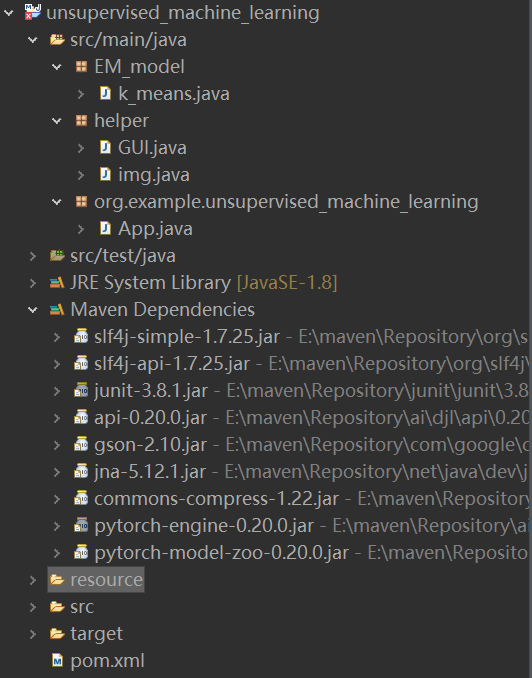
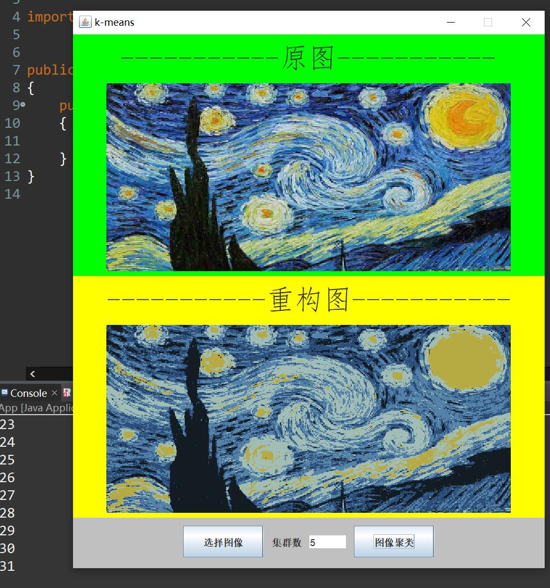
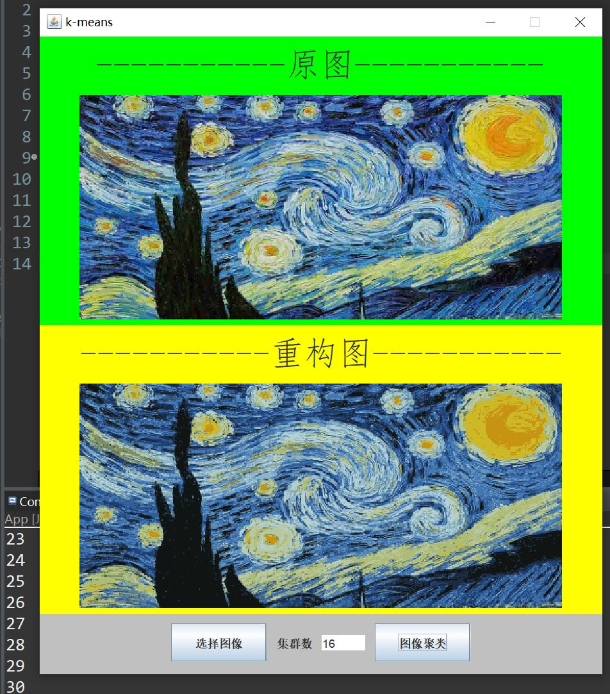

# 无监督学习

## 前言

本人的第一个java项目，纪念一下，证明我能写java了不是(doge)。

本仓库为[Unsupervised-learning](https://github.com/BeiYazi0/Unsupervised-learning)试图迁移到java的版本。

已实现k-means聚类，暂未实现 EM 算法的高斯混合模型。

### 拉取仓库

```
git clone https://github.com/BeiYazi0/Unsupervised-learning-java
```

## 概述

无监督学习就是在一堆没有标签化，没有进行过分类的数据中，发现它们之间的共性，然后利用它们之间的共性对新的数据进行操作。我们将实现两种无监督学习算法：k-means 和 EM 算法。

高斯混合模型是 EM 算法的一个应用，它可以从一堆若干类的样本集中提取出不同类的高斯模型出来，我们通过以下内容实现一个高斯混合模型:

1. 实现 k-means 聚类。

2. 通过在简单数据集上运行它来熟悉算法。

3. 构建一个经过期望最大化训练的高斯混合模型。

4. 改进高斯混合模型实现的细节。

5. 实现一种新的度量（贝叶斯信息准则），以得到更鲁棒的模型。

## Prepare: DJL

DJL —— 完全由 Java 构建的深度学习平台。

随着数据科学在生产中的应用逐步增加，使用 N维数组 灵活的表达数据变得愈发重要。我们可以将过去数据科学运算中的多维循环嵌套运算简化为简单几行。由于进一步释放了计算并行能力，这几行简单的代码运算速度也会比传统多维循环快很多。

这种数学计算的包已经成为数据科学、图形学以及机器学习领域的标准。同时它的影响力还在不断的扩大到其他领域。

在 Python 的世界，调用 NDArray（N维数组）的标准包叫做 NumPy。但是如今在 Java 领域中，并没有与之同样标准的库。为了给 Java 开发者创造同一种使用环境，亚马逊云服务开源了 DJL 一个基于 Java 的深度学习库。

尽管它包含了深度学习模块，但是它最核心的 NDArray 系统可以被用作 N维数组 的标准。它具备优良的可扩展性、全平台支持以及强大的后端引擎支持 (TensorFlow、PyTorch、Apache MXNet）。无论是 CPU 还是 GPU、PC 还是安卓，DJL 都可以轻而易举的完成任务。

项目地址：[djl](https://github.com/awslabs/djl/)

接下来，我们将进一步了解 NDArray，并且学习如何写与 Numpy 同样简单的 Java 代码。

### 安装 DJL

#### 配置 gradle 项目
```
plugins {
    id 'java'
}
repositories {                           
    jcenter()
}
dependencies {
    implementation "ai.djl:api:0.6.0"
    // PyTorch
    runtimeOnly "ai.djl.pytorch:pytorch-engine:0.6.0"
    runtimeOnly "ai.djl.pytorch:pytorch-native-auto:1.5.0"
}
```

#### 配置 Maven 项目

```
    <dependency>
		<groupId>ai.djl</groupId>
		<artifactId>api</artifactId>
		<version>0.20.0</version>
	</dependency>
	<dependency>
		<groupId>ai.djl.pytorch</groupId>
		<artifactId>pytorch-engine</artifactId>
		<version>0.20.0</version>
		<scope>runtime</scope>
	</dependency>
	<dependency>
		<groupId>ai.djl.pytorch</groupId>
		<artifactId>pytorch-model-zoo</artifactId>
		<version>0.20.0</version>
    </dependency>
```

### 基本操作

首先尝试建立一个 try block 来包含我们的代码

```
try(NDManager manager = NDManager.newBaseManager()) {
}
```

NDManager 是 DJL 中的一个 class 可以帮助管理 NDArray 的内存使用。通过创建 NDManager 我们可以更及时的对内存进行清理。当这个 block 里的任务运行完成时，内部产生的 NDArray 都会被清理掉。这个设计保证了我们在大规模使用 NDArray 的过程中，可以通过清理其中的 NDManager 来更高效的利用内存。

#### 创建 NDArray

`ones `是一个创建全是1的N维数组操作
```
NDArray nd = manager.ones(new Shape(2, 3));
/*
ND: (2, 3) cpu() float32
[[1., 1., 1.],
 [1., 1., 1.],
]
*/
```
可以尝试生成随机数。比如我们需要生成一些从 0 到 1 的随机数
```
NDArray nd = manager.randomUniform(0, 1, new Shape(1, 1, 4));
/*
ND: (1, 1, 4) cpu() float32
[[[0.932 , 0.7686, 0.2031, 0.7468],
 ],
]
*/
```

#### 数学运算

可以使用 NDArray 进行一系列的数学操作。假设想对数据做一个转置操作，然后对所有数据加一个数的操作。可以参考如下的实现：

```
NDArray nd = manager.arange(1, 10).reshape(3, 3);
nd = nd.transpose();
nd = nd.add(10);
/*
ND: (3, 3) cpu() int32
[[11, 14, 17],
 [12, 15, 18],
 [13, 16, 19],
]
*/
```

DJL 支持 60 多种不同的 NumPy 数学运算，基本涵盖了大部分的应用场景。

[Interface NDArray](https://javadoc.io/doc/ai.djl/api/latest/ai/djl/ndarray/NDArray.html)

#### Get 和 Set

一个对于 NDArray 最重要的亮点就是它轻松简单的数据设置/获取功能。参考 NumPy 的设计，将 Java 过去对于数据表达中的困难做了精简化处理。

假设想筛选一个N维数组所有小于10的数

```
NDArray nd = manager.arange(5, 14);
nd = nd.get(nd.gte(10));
/*
ND: (4) cpu() int32
[10, 11, 12, 13]
*/
```

接下来，看一下一个稍微复杂一些的应用场景。假设现在有一个3x3的矩阵，然后我们想把第二列的数据都乘以2:

```
NDArray nd = manager.arange(1, 10).reshape(3, 3);
nd.set(new NDIndex(":, 1"), array -> array.mul(2));
/*
ND: (3, 3) cpu() int32
[[ 1,  4,  3],
 [ 4, 10,  6],
 [ 7, 16,  9],
]
*/
```

在 Java 引入了一个 NDIndex 的 class。它复刻了大部分在 NumPy 中对于 NDArray 支持的 get/set 操作。只需要简单的放进去一个字符串表达式，开发者在 Java 中可以轻松玩转各种数组的操作。

[Class NDIndex](https://javadoc.io/doc/ai.djl/api/latest/ai/djl/ndarray/index/NDIndex.html)

## Part 0: 项目结构

本项目为 Maven 项目，前期准备不再赘述。

jdk版本：1.8 or above.

项目组织结构如下图



1. `src` 用于存放项目代码和测试代码，本项目无测试代码。

2. `JRE System Library` 是运行JAVA程序所必须的环境的集合，包含JVM标准实现及Java核心类库。

3. `Maven Dependencies` 是第三方依赖。

4. `resource` 存放本项目所需的资源，主要是图像。

5. `target` 存放生成的 class 文件以及经过打包生成的 jar 包。

6. [pom.xml](pom.xml) 用于配置引入第三方依赖。

项目代码由以下三个包组成：

### Part 0a: EM_model

EM 算法模型的实现，包括 k-means 模型和高斯混合模型。

k_means 类的成员和方法，详见[k_means.java](src/main/java/EM_model/k_means.java)。
```
NDArray o_array, array, mean; // 原矩阵，k-means可处理的矩阵，集群中心值
NDManager manager;            // 管理器
int k;                        // 集群数
Shape shape;                  // o_array 的形状(高, 宽, 通道数)

public k_means(BufferedImage bf, int k); // 构造函数

public void set_o_array(int[][][] rgb3DArray, int height,int width); // 将 rgb 数组转换为 NDArray

public int[][][] get_rgbarray(int height,int width); // 由 NDArray 还原 rgb 矩阵

public NDArray shuffle(NDArray array, int k); // 选定 axis 进行打乱

public void get_initial_means(); // 初始化 k 个集群的中心值

public NDArray k_means_step(int m); // k-means 单步

public BufferedImage segment(int max_iter); // 训练模型并重构图像
	
public void close(); // 释放内存
```

gauss_model 类的方法（k_means 类的子类，暂未实现，可能的形式）
```
initialize_parameters(X, k); // 初始化 k 个点，返回均值、协方差和初始混合系数

prob(X, mu, sigma); // 根据均值和协方差给出了一个概率密度估计

E_step(X,MU,SIGMA,PI,k); // 单步 1，计算每个集群的概率密度估计（责任矩阵）

M_step(X, r, k); // 单步 2，根据责任矩阵重新计算均值、协方差和混合系数

loglikelihood(X, PI, MU, SIGMA, k); // 计算训练模型的对数似然

train_model(X, k); // 训练混合模型，迭代 E_step 和 M_step 直到收敛(似然值判定)

cluster(r); // 根据责任矩阵得到使得似然值最大的集群索引(分类)

segment(X, MU, k, r); // 每个数据点被替换为集群值(最大似然分量均值)

best_segment(X,k,iters); // 通过反复训练模型并计算其似然，确定图像的最佳分割
```

### Part 0b: helper

工具包

`GUI.java` 构建用户界面，详见[GUI.java](src/main/java/helper/GUI.java)。

`img.java` 实现与图像相关的操作，其方法如下，详见[img.java](src/main/java/helper/img.java)。
```
public static BufferedImage readImage(String imageFile); /* 读取指定路径图像为BufferedImage类型图像*/

public static void writeImage(String imageFile, BufferedImage image); /* 写入指定路径图像为BufferedImage类型图像*/
 
public static BufferedImage array2Image(int[][][] rgb3DArray, int height, int width); /* 将数组rgb3DArray转换为BufferedImage类型图像*/

public static int[][][] image2array(BufferedImage bf);/* 将BufferedImage类型图像转换为数组rgb3DArray*/
```

### Part 0c: org.example.unsupervised_machine_learning

`App.java` 是主函数的入口，详见[App.java](src/main/java/org/example/unsupervised_machine_learning/App.java)。

## Part 1: K-means 聚类

k-means 聚类是一种简单的图像分割方法，它将所有相似的数据点聚在一起，然后用平均值替换它们的值。

### Part 1a:`k_means` 类的实现

#### `get_initial_means()` 

从数据中随机选择 k 个点作为集群的初始点，此时集群的均值就是每个点的值。
```
public void get_initial_means() {
	NDArray newArr = shuffle(this.array, 0);                // 随机打乱
	this.mean = newArr.get(new NDIndex("0:" + k + ",:"));   // 选择前 k 个点
	newArr.close();
}
```

#### `k_means_step()` 

根据 k 个集群的均值对数据进行分类，每个点都将分到一个集群中，之后我们将根据集群中的点重新计算集群的均值 new_means。

```
public NDArray k_means_step(int m) {	
	// 样本的分类结果
	NDArray clusters = manager.zeros(new Shape(m));
	int[][] axes = {{0},{1}};
	for(int i = 0; i < m; i++) {
		NDArray curSample = array.get(i);  // 当前的样本
			
		// 计算样本的二范数(样本与各个集群中心值的距离)
		NDArray diff = mean.sub(curSample);
		NDArray norm = diff.norm(axes[1]);
			
		// 聚类，每个样本归类到距离其最近的集群
		NDArray cluster = norm.argMin();
		clusters.set(new NDIndex(i), cluster);
			
		// 回收
		diff.close();
		curSample.close();
		norm.close();
		cluster.close();
	}
		
	// 所有样本的索引
	NDArray index = manager.arange(m);
	// 更新每个集群的新的中心值
	for(int i = 0; i < k; i++) {
		// 属于集群 i 的所有样本的索引
		NDArray mask = clusters.eq(i);
		NDArray cur_index = index.get(mask);
		// 属于集群 i 的所有样本
		NDArray cluster_samples = array.get(cur_index);
			
		// 集群中心值是所有属于该集群的样本的均值
		if(!cluster_samples.isEmpty()) {
			NDArray mean = cluster_samples.mean(axes[0]);
			this.mean.set(new NDIndex(i + ",:"), mean);
			mean.close();
		}
			
		// 回收
		mask.close();
		cur_index.close();
		cluster_samples.close();
	}
	index.close();
	return clusters;
}
```

#### `segment()` 

使用 K-means 算法将图像的 RGB 值分离到 k 个集群中，然后将图像的原始值替换为相应的集群中心值，重构图像以观察效果。

显然，当分配的聚类停止变化时，算法达到收敛。然而，这个收敛的过程可能相当慢，因此我们设定一个最大迭代次数。

```
public BufferedImage segment(int max_iter) {
	// 原图的大小
	int r = (int)shape.getShape()[0];
	int c = (int)shape.getShape()[1];
	int ch = (int)shape.getShape()[2];
	int m = r*c;
		
	// 创建一个 k_means_step 可以处理的矩阵
	Shape arr_shape = new Shape(m, ch);
	this.array = this.o_array.reshape(arr_shape);
		
	// 初始化
	get_initial_means();
		
	NDArray preClusters = manager.zeros(new Shape(m));     // 原集群  
	// 迭代直到收敛或达到最大迭代次数
	for(int i = 0; i < max_iter; i++) {
		System.out.println(i);
		NDArray curClusters = k_means_step(m); // 新的集群
			
		// 收敛时结束迭代
		if(preClusters.contentEquals(curClusters)) {
			break;
		}
			
		preClusters.set(new NDIndex(":"), curClusters);
		curClusters.close();
	}
		
	// 将原始值替换为相应的集群值并重构图像
	this.array.close();
	NDArray updated_array = mean.get(preClusters);
	this.array = updated_array.reshape(shape).toType(DataType.INT32, false);
	int[][][] rgb3DArray = get_rgbarray(r, c);
	BufferedImage update_Bufimg = img.array2Image(rgb3DArray, r, c);
	preClusters.close();
	updated_array.close();
	return update_Bufimg;
}
```

### Part 1b:测试效果

可视化 K-means 进行图像分割的结果

设定集群值为5，最大迭代次数为32



设定集群值为16，最大迭代次数为32



### Part 1c:jar 包生成

需要在 pom.xml 文件中配置以下插件。
```
<groupId>org.springframework.boot</groupId>
<artifactId>spring-boot-maven-plugin</artifactId>
<!-- maven工程打包，可以将手动拖入的包也引用进目标jar包 -->

<groupId>org.apache.maven.plugins</groupId>
<artifactId>maven-compiler-plugin</artifactId>
<!-- 指定项目源码的 jdk 版本，编译后的 jdk 版本 -->

<groupId>org.apache.maven.plugins</groupId>
<artifactId>maven-assembly-plugin</artifactId>
<!-- 将项目输出与它的依赖项、模块、站点文档、和其他文件一起组装成一个可分发的归档文件。-->

<groupId>org.apache.maven.plugins</groupId>
<artifactId>maven-jar-plugin</artifactId>
<!-- 设定 MAINFEST .MF文件的参数，比如指定运行的Main class、将依赖的jar包加入classpath中等等-->
```

使用 Maven Install 进行打包。

生成位于 target 文件夹下的两个包：k_means.jar 和 k_means-jar-with-dependencies.jar。

两个包中均设定了主函数入口，可以运行。

区别在于，k_means-jar-with-dependencies.jar 包含第三方依赖，可以直接运行。

## Part 2:  实现一个多元高斯混合模型

接下来，我们试着引入高斯分布来实现一个多元高斯期望最大化(Multivariate Gaussian Expectation Maximization)算法。EM 算法是一种通用算法，它允许人们迭代计算统计分布的最大似然估计量。在我们的方案中，我们关注的是高斯混合模型的最大似然估计量(MLEs)。

- - - 

以下函数将会被组装成一个多元高斯期望最大化算法：

1. 计算给定数据点(例如像素的 rgb 值)属于特定高斯分量的概率。

2. 使用期望最大化(EM)训练模型，将图像表示为高斯的混合。

3. 计算训练模型的对数似然。在 default_convergence() 中为你设置了收敛条件(参见 helper_functions.py 文件)：如果连续 10次迭代，新的似然值在之前似然值的 10% 以内，则模型已经收敛。

4. 根据训练好的模型对图像进行分割。

5. 通过在模型训练和评分上迭代来确定最佳分割，因为 EM 不能保证收敛到全局最大值。初始化时 k 个点的选取完全是随机的，实际上算法对这初始化的 k 个中心是非常敏感的。

#### 需要完成的函数：
1. `initialize_parameters()`
2. `prob()`
3. `E_step()`
4. `M_step()`
5. `likelihood()`
6. `train_model()`
7. `cluster()`
8. `segment()`
9. `best_segment()`

## Part 3:  模型改进

现在，我们将尝试做出改进来提高高斯混合模型的性能。

### Part 3a:  改进初始化函数

通过训练一个高斯混合模型来寻找初始均值。这种类型的初始化不同于简单地增加训练时间，因为我们“重置”了协方差和混合系数参数。

也就是说，对于训练，我们根据初始化期间学到的均值重新计算协方差参数，并再次将混合系数设置为均匀分布。

一个 GMM 倾向于收敛到拉长的协方差，所以通过重置这些参数我们有更高的机会避免局部极大值（相比于随机初始化）。

### Part 3b: 收敛条件

实现 `new_convergence_condition()` 函数，它给出一个新的收敛条件。如果连续 10次迭代，所有新的模型参数(均值、方差和混合系数)都在前一个变量的 10%以内，则返回 true。

同时，我们需要在 `train_model_improved()` 函数中重新实现 `train_model()` 。

## Part 4: 贝叶斯信息准则

在上述方案中，我们选择模型的唯一标准是它是否使后验似然最大化，而不管它需要多少参数。因此，“最佳”模型可能只是具有最多参数的模型，这将对训练数据过度拟合。

为了避免过拟合，我们可以使用贝叶斯信息准则(BIC)，它会根据模型使用的参数数量来惩罚模型。这里惩罚包括复杂度惩罚和精度惩罚，显然，复杂度惩罚与模型参数（最主要是集群数）有关，精度惩罚与似然值有关。

### Part 4a: 实现贝叶斯信息准则

实现 `bayes_info_criterion()` 函数，它将用于计算训练好的高斯混合模型的 BIC。

BIC 的计算公式如下：
BIC = ln(m)k–2 * In(L) (m - 样本数量, k - 参数量, L - 似然值)  
值得注意的是，`k` 在 BIC 中是模型估计的参数个数，而不是聚类值。显然，`k` 由均值、协方差和混合系数的参数个数确定。

### Part 4b: 测试贝叶斯信息准则

在 `BIC_likelihood_model_test()`函数中，你将使用 BIC 和 似然值 来确定 `image_matrix` 的最佳聚类值。

使用 `train_model_improved()` 函数， 遍历所提供的均值列表（`comp_means`）， 训练一个最小化 BIC 的模型和一个最大化似然值的模型。

`comp_means` 是一个列表，其中每个元素是一个 k x n 的均值矩阵（k 是聚类值）。

## 存在的问题

### 内存泄漏

NDArray 对象即使不再被引用，也不会被 JVM 作为内存垃圾进行处理，结束其使命后使用 `close()` 方法能有效地回收被占用的内存。

虽然 NDmanger 实现 AutoCloseable 的 close 接口，会遍历 resources 调所有 NDArray 的 close 方法，但是本项目代码中依然采取随用随清的策略。

然而，这并没有完全解决问题。

尽管已经释放了尽可能多的内存，但整个程序所占用的内存依然在缓慢增长。

这似乎是 DJL 自身的 bug， NDManager 即使执行了 close，但是还是被引用，导致自身无法被回收。

目前暂无解决方案。

